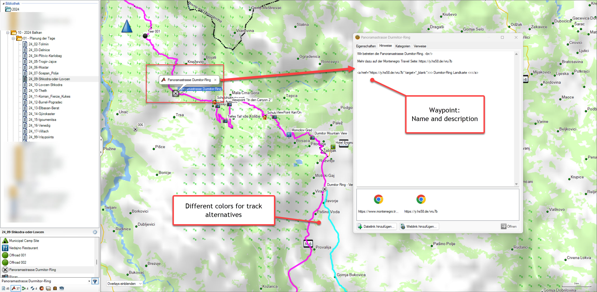
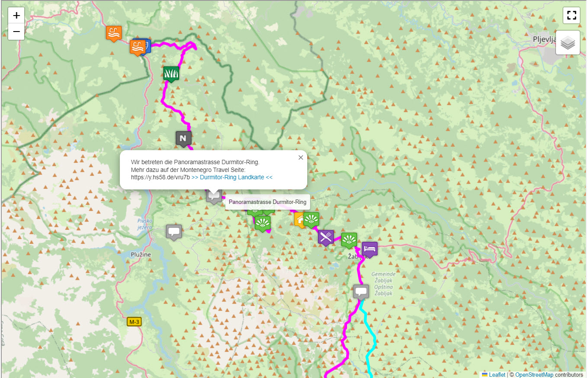

# **gpx_2_html**
Based on Garmin/Basecamp GPX export create a HTML map using track colors and waypoint icons.

## Version and Licence ##

- Version 02/2024
 Written by Hans Strassguetl - [https://gravelmaps.de](https://gravelmaps.de/)  
 Licenced under [https://creativecommons.org/licenses/by-sa/4.0/](https://creativecommons.org/licenses/by-sa/4.0/)  
- Icons used are licensed under  
 Map Icons Collection  
 Creative Commons 3.0 BY-SA  
 Author: Nicolas Mollet  
[https://mapicons.mapsmarker.com](https://mapicons.mapsmarker.com/)  

## About ##

This program is used to convert GPX files exported from Garmin Basecamp in one go into a html website translating Garmin icons.

## Use: ##

### Planning: ###

- Planning is done in Garmin Basecamp.
- Waypoints and Tracks may include a description
- Export data via Basecamp File -> Export function.

### Conversion ###

GPX_2_hTML has no user interface. Start it that way: 

``` python gpx_2_html.py “your.gpx” ```

As a result, you have a converted HTML with the same name in the same directory as the GPX. If there are any errors, you will be informed.  

You may need to install Python and / or some missing libraries.

## Example ##

Planning in Basecamp:  



Result in werbsite:  




## Read more ##
Get more information by reading readme-licence.pdf
